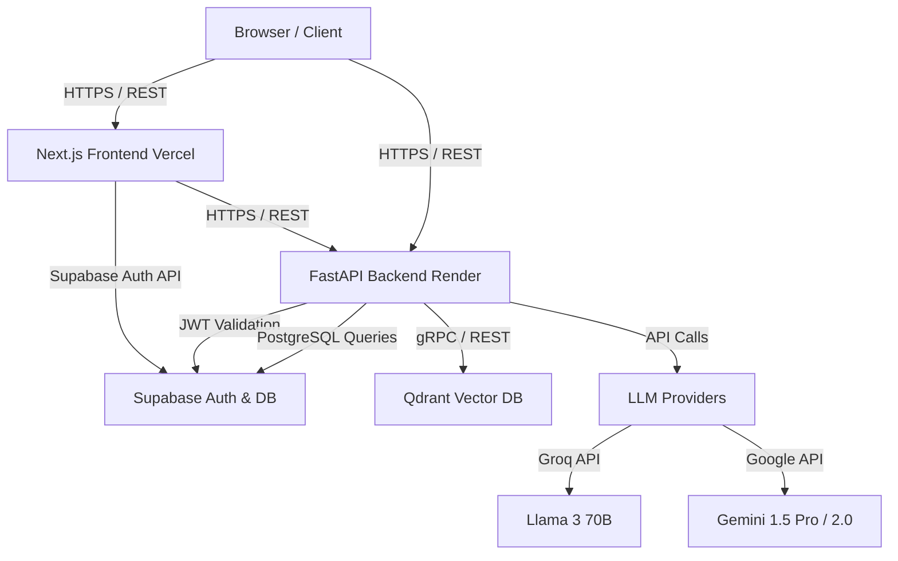

# Architecture Overview

Cortex AI (StudyOS) is built on a decoupled, modern web architecture to separate the highly interactive frontend UI from the computationally heavy AI and database operations.

## High-Level Architecture Diagram

## 1. Frontend: Next.js (Vercel)

The frontend is a Next.js 15 App Router application hosted on Vercel. 
- **State Management**: It uses a combination of `Zustand` for local/UI state (like sidebar toggles, theme, selected notes) and `TanStack Query` (React Query) for server state and API caching.
- **Styling**: `Tailwind CSS` for utility-first styling and `shadcn/ui` (built on Radix UI) for accessible, unstyled components.
- **Canvas**: Integrates `tldraw` (v2) for a massive, infinite whiteboard experience that supports shapes, arrows, and freehand drawing.
- **Text Editor**: A rich-text editor for markdown-like typing.

## 2. Backend: FastAPI (Render)

The backend is a high-performance Python FastAPI application hosted on Render.
- **Why Python?**: Python is the lingua franca of AI. Using FastAPI allows Cortex to easily integrate with libraries like `langchain`, `sentence-transformers`, and various LLM SDKs without having to write awkward JavaScript bridges.
- **Database ORM**: Uses `SQLAlchemy` to interact with the PostgreSQL database.
- **Dependency Injection**: Relies heavily on FastAPI's dependency injection system to handle Database sessions and JWT Authentication securely.

## 3. Vector Database: Qdrant

To make "Chat with PDF" and semantic search possible, Cortex relies on **Qdrant**.
- When a user uploads a PDF, the FastAPI backend extracts the text, chunks it into smaller paragraphs, and runs it through an embedding model (like `BGE-m3`).
- These vectors (arrays of floating point numbers) are stored in Qdrant.
- When a user asks a question, their question is embedded into a vector, and Qdrant performs a Cosine Similarity search to find the most relevant chunks of text from the textbook to feed into the LLM context window.

## 4. Authentication Flow

Auth is entirely handled by **Supabase**.
1. The user logs in via the Next.js frontend using Supabase Auth.
2. Supabase sets a secure session cookie and returns a JWT (JSON Web Token).
3. Whenever the frontend needs to request data from the FastAPI backend (e.g., to fetch notes or generate a flashcard), it attaches the JWT in the `Authorization: Bearer <token>` header.
4. The FastAPI backend extracts the JWT and uses the `SUPABASE_SERVICE_ROLE_KEY` to cryptographically verify the token with the Supabase API. If valid, the request proceeds.

## 5. Deployment

- **Frontend**: Automatically deployed via Vercel GitHub integration. Vercel handles the Edge network distribution, static asset caching, and Next.js serverless functions.
- **Backend**: Deployed on Render using a Dockerfile or standard Python environment. Render provides an easy way to host the FastAPI app with background workers if necessary.
- **Database**: Supabase provides the managed PostgreSQL database.
